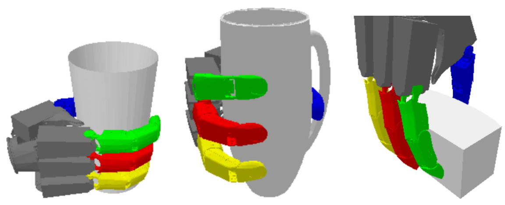
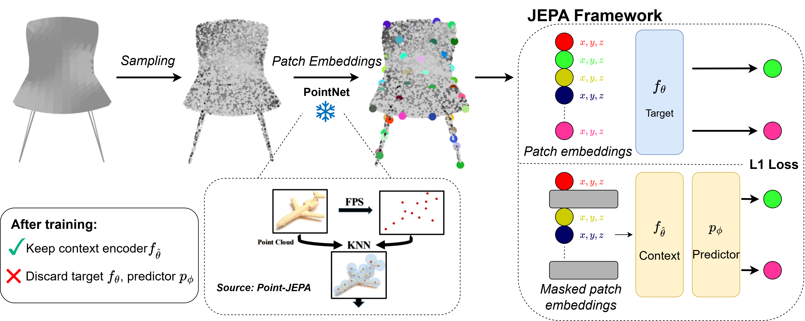
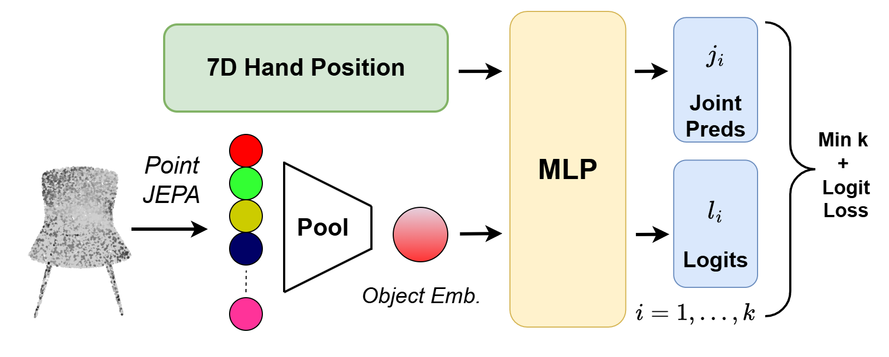
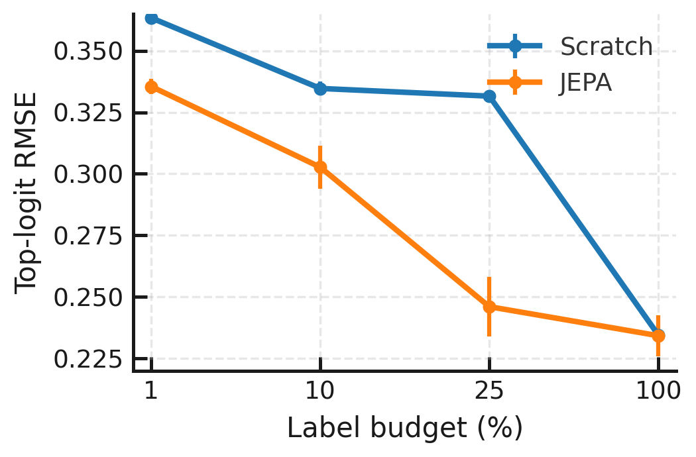
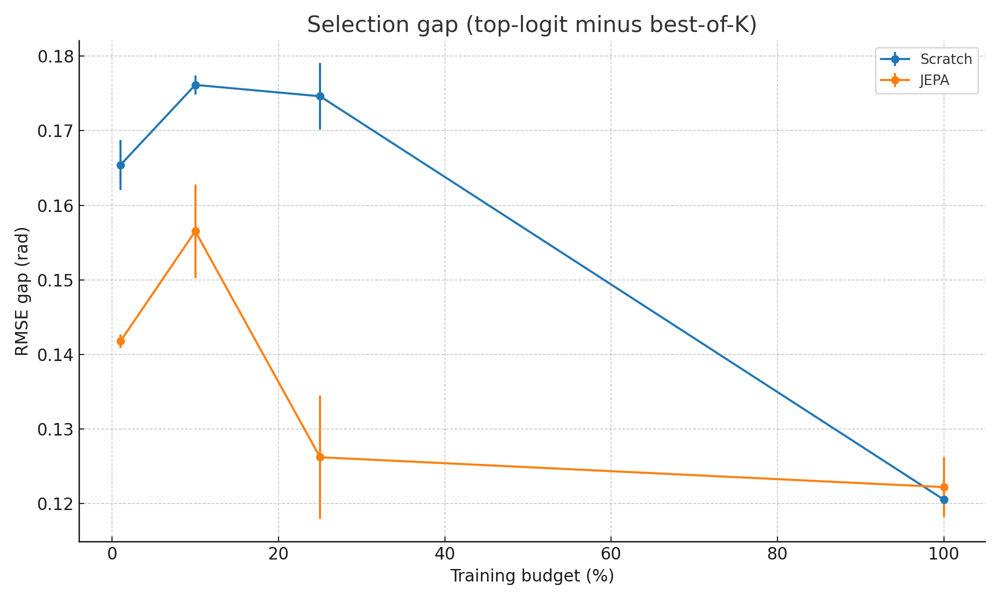
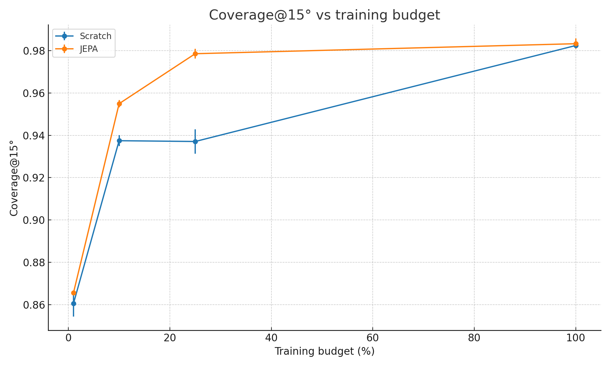
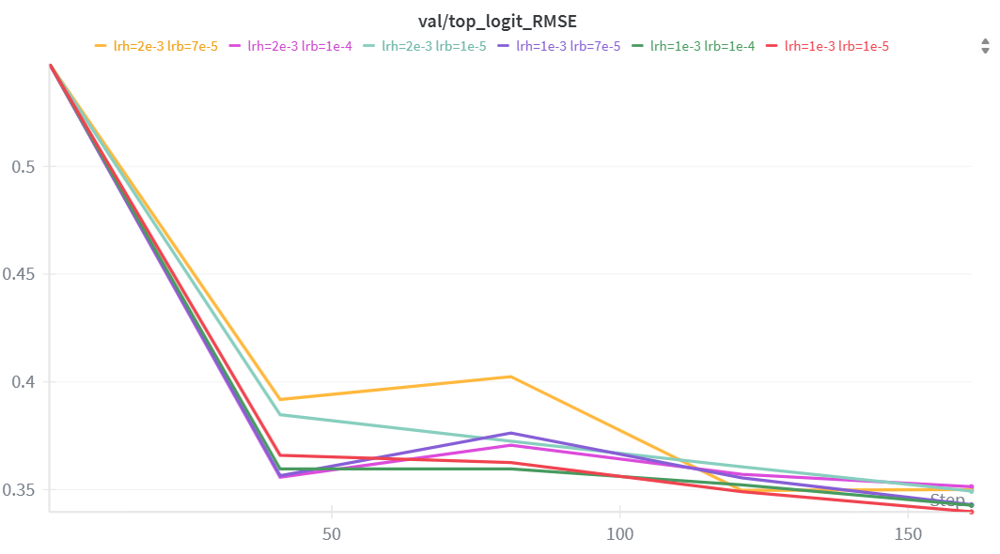

# Label-Efficient Grasp Joint Prediction with Point–JEPA

> **Status:** under submission for IROS 2025 workshop.


*Top-logit predictions (K=5) for several object–pose pairs; model outputs a 12D joint vector conditioned on object point cloud + 7D wrist pose.*

---

## TL;DR
Pretrain a Point–JEPA backbone on ShapeNet point clouds, then fine-tune a lightweight K-hypothesis grasp head with winner-takes-all (min-over-K). This yields substantial gains in low-label regimes on DLR–Hand II and parity at full labels. **No negatives and no input-space reconstruction** are used in JEPA pretraining.

---

## Method Overview


*Meshes → point clouds → tokenized patches → self-distilled JEPA features. The predictor and EMA target are discarded after pretraining; we keep the context encoder.*



*Attention-pooled object embedding ⊕ 7D wrist pose → K joint vectors + logits. Train with min-over-K on L2 joint error + CE on the winning index; inference uses **top-logit** (no oracle).*

**Pretraining (external Point–JEPA checkpoint).** We do **not** pretrain JEPA in this repository. We use the **official Point–JEPA checkpoint released by the authors**, trained on ShapeNet point clouds with a block-masking JEPA objective (**no negatives** and **no input-space reconstruction**).

**Backbone.** Point–JEPA context encoder (from the external checkpoint) with block masking and a simple sequencer so context/target windows are contiguous in token order.  
**Representation.** 1024 points/object; tokenizer: 64 groups (size 32, radius 0.05); attention pooling for a global embedding.  
**Head & Loss.** K=5 hypotheses; winner-takes-all (min-over-K) on L2 joint error + cross-entropy on the winner; inference uses top-logit.

---

## Dataset & Splits

- **DLR–Hand II** (non-public). We release code/protocols and model weights, but **no raw data**.  
- **Object-level, category-stratified** splits to avoid pose leakage. Fixed val/test (10% + 10%).  
- **Training budgets** \(p \in \{1,10,25,100\}\%\) sampled from remaining objects (≥1 per synset).  
- **Split packs A/B** for reproducibility. Pack A covers all budgets; Pack B is used at 25% and 100% as anchors.

> **Data access.** You must have internal rights to DLR–Hand II to reproduce preprocessing. We provide filtering scripts (e.g., quality ≥ 1.5), split manifests (A/B), and point-cloud tokenization tools.

---

## Results (Test split; Top-Logit RMSE ↓)

| Train % | Scratch (↓)      | JEPA (↓)         | Rel. Δ |
|:------:|:------------------|:-----------------|:------:|
| 1      | 0.363 ± 0.002     | 0.335 ± 0.003    | +7.7%  |
| 10     | 0.335 ± 0.003     | 0.303 ± 0.009    | +9.6%  |
| 25 †   | 0.332 ± 0.002     | 0.246 ± 0.012    | +25.9% |
| 100 †  | 0.235 ± 0.002     | 0.234 ± 0.008    | +0.4%  |


† Averages across Packs A+B.


*JEPA helps most at 25%; parity at 100%.*

**Additional metrics.** Coverage@{10°,15°,20°}, diversity, and **selection gap** (best-of-K vs top-logit).

---

## Extended Figures (not in paper due to space; included here)

- Selection-gap vs budget: 
- Coverage@15° vs budget: 
- LR sensitivity grid (10%):  

---

## Environment

```bash
conda create -n point-jepa-grasping python=3.10 -y
conda activate point-jepa-grasping
pip install -r requirements.txt
```

---

## Data Availability & Preparation

DLR–Hand II is non-public. We release split manifests (Packs A/B), preprocessing interfaces, configs, and checkpoints.

For authorized users with access to the raw dataset:

```bash
export DLR_HAND_ROOT="/secure/location/DLR_HAND_II"   # your private path

# Pack A (seed=0) — budgets: 1,10,25,100
python -m data.make_splits "$DLR_HAND_ROOT" configs/splits --pack A --seed 0 --budgets 1 10 25 100

# Pack B (seed=1) — anchors: 25,100
python -m data.make_splits "$DLR_HAND_ROOT" configs/splits --pack B --seed 1 --budgets 25 100

```

> We release split JSONs and preprocessing interfaces; no raw meshes are provided.

---

## Pretrained Point–JEPA (credit & setup)

We use the official **Point–JEPA** encoder checkpoint released by the authors (trained on ShapeNet with a block-masking JEPA objective).  
**Credit:** Point–JEPA authors. Please obtain the checkpoint from the official repository https://github.com/Ayumu-J-S/Point-JEPA and comply with its license.

**Expected filename and location in this repo**
- Save as: `checkpoints/pretrain_pointjepa_epoch=499-step=40500.ckpt`

Ensure that bucket="" in the config if checkpoint is saved locally.

---
## Training (downstream grasp head & optional JEPA fine-tuning)

**Single run (example):** Pack A, 25% budget, JEPA fine-tune, seed 0

```bash
python trainer_joint.py --config-name full \
  data.split_file="$(pwd)/configs/splitsA/split_25.json" \
  ckpt.load_backbone=true \
  train.seed=0 \
  logger.name="NEWSPLIT_A_jepa_split25_seed0"
```

### Loss
$$
k^{\star}=\arg\min_{k}\lVert \hat{j}_{k}-j \rVert_{2},\quad
\mathcal{L}=\lVert \hat{j}_{k^{\star}}-j \rVert_{2}+\alpha\ \cdot \mathrm{CE}(\ell,k^{\star}).
$$

**Inference:** uses **top-logit**.

---

## Reproduce the paper grid (one line)

Runs both packs (A and B) with default budgets:
 - Pack A: 1,10,25,100 (seed=0)
 - Pack B: 25,100      (seed=1)


`python sweep_joint.py --packs A B`

Ensure the Point–JEPA checkpoint is present locally at: `checkpoints/pointjepa/pretrain_pointjepa_epoch=499-step=40500.ckpt`.

---

## Metrics & logging

We compute and log all reported metrics via a Lightning callback:
`src/callbacks/additional_metrics_callbacks.py`.

**Logged metrics (per val/test step as configured):**
- `toplogit_rmse` — main metric (↓).
- `coverage@10`, `coverage@15`, `coverage@20` — fraction within θ degrees (↑).
- `selection_gap` — difference between best-of-K and top-logit evaluation (↓).
- `diversity` — hypothesis set spread proxy (↑).

**Where to find results**
- **Weights & Biases:** metrics appear live in the run’s *summary* and *charts* (project/name from your Hydra config).
- **Local CSV:** `callbacks/save_metrics_csv.py` also writes a `metrics.csv` for each run under the Lightning run directory (same root as `cfg.trainer.default_root_dir`). You can also download the same CSV from the W&B run “Files” tab.

---

## Limitations

- Gains concentrate in the low-label regime; parity at full labels.  
- MDN-style density heads were brittle in 12D joint space; K-hypothesis WTA aligned better with top-logit inference.  
- Future: cross-domain evaluation (novel categories, real robot), tokenizer variants, lightweight adaptation (e.g., LoRA).

---

## Ethics & Data Usage

- DLR–Hand II data are not redistributed. Only split manifests and preprocessing interfaces are provided.  
- Ensure compliance with dataset licenses and institutional approvals before reproducing experiments.

---

## License

This code is released under the [MIT License](LICENSE).  
**Note:** Dataset usage is subject to the original dataset’s license/terms.

## Contact

For questions: jed.guzelkabaagac@tum.de
